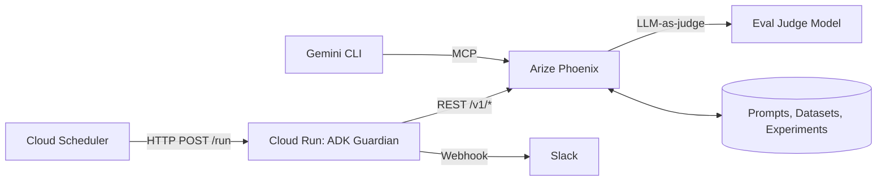
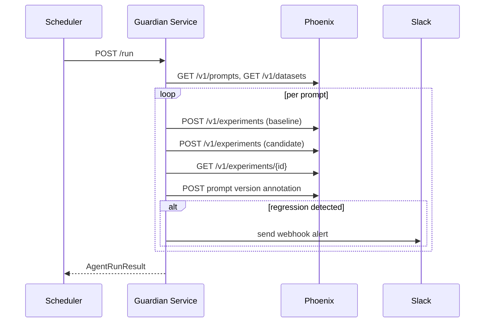

# Prompt Regression Guardian

Prompt Regression Guardian is a Google ADK (Agent Development Kit) service that checks new prompt versions before they ship. It evaluates candidates against a stable baseline in Phoenix, labels the candidate version, and alerts Slack if quality regresses.

## Contents
- [Overview](#overview)
- [Key features](#key-features)
- [How it works](#how-it-works)
- [Architecture](#architecture)
- [Run sequence](#run-sequence)
- [Requirements](#requirements)
- [Local quickstart](#local-quickstart)
- [API endpoints](#api-endpoints)
- [Configuration](#configuration)
- [Self-introspection loop](#self-introspection-loop)
- [Deployment to Cloud Run](#deployment-to-cloud-run)
- [Project layout](#project-layout)
- [Testing](#testing)
- [Troubleshooting](#troubleshooting)
- [License](#license)

## Overview
Prompt Regression Guardian is a FastAPI service that runs prompt regression checks on demand using Google ADK. For each prompt, it runs two Phoenix experiments (baseline and candidate), compares results, annotates the candidate version, and sends Slack alerts if regressions are detected.

## Key features
- Baseline selection from `baseline_version_id` or the `stable` label.
- Per-dimension regression detection with a configurable threshold.
- Verdict labels applied to candidate versions: `stable`, `regression-detected`, `needs-review`.
- Slack alerts with Phoenix experiment links on failures.
- Google ADK agent with REST-based Phoenix tool calls.
- OpenTelemetry tracing wired to Phoenix with ADK auto-instrumentation.

## How it works
1. List prompts and datasets from Phoenix via the REST API.
2. For each prompt, find a baseline version and the latest candidate.
3. Run Phoenix experiments for baseline and candidate using the configured judge model.
4. Compare mean scores and dimension deltas, then build a verdict.
5. Annotate the candidate version with a label and summary.
6. Send a Slack alert if the verdict is `fail`.

## Architecture


## Run sequence


## Requirements
- Node 20 (for Phoenix MCP via Gemini CLI self-introspection)
- Python 3.11
- Google AI Studio API key (`GOOGLE_API_KEY`)
- Google Cloud SDK (for deployment)
- Arize Phoenix instance (local or cloud)
- Slack incoming webhook URL

## Local quickstart
Command placeholders used below:
- Use `<ENV_TEMPLATE>` for [.env.example](.env.example)
- Use `<REQUIREMENTS_FILE>` for [requirements.txt](requirements.txt)
- Use `<SEED_SCRIPT>` for [scripts/seed_phoenix.py](scripts/seed_phoenix.py)
- Use `<TRIGGER_SCRIPT>` for [scripts/trigger_local.py](scripts/trigger_local.py)

1. Clone the repository and move into the repo directory.
2. Create a local environment file from the template and fill in values.
3. Install dependencies and start Phoenix.
4. Seed Phoenix with demo data (optional but recommended for a first run).
5. Run the guardian service and trigger a run.

```bash
git clone <REPO_URL>
cd <REPO_DIR>

cp <ENV_TEMPLATE> <LOCAL_ENV_FILE>

pip install -r <REQUIREMENTS_FILE>
python -m phoenix.server.main

python <SEED_SCRIPT>

python -m agent.main
# Or run with the ADK CLI if available:
# adk run agent/
python <TRIGGER_SCRIPT>
```

## API endpoints
- `GET /healthz` returns service health.
- `POST /run` triggers a full regression check. Accepts an optional JSON payload: `{ "project_name": "my-project" }`.
- `GET /status` returns the most recent run result or a 404 if no runs have completed.

## Configuration
Environment values are loaded with Pydantic Settings. The template file is [.env.example](.env.example).

| Variable | Description | Required |
| --- | --- | --- |
| `PHOENIX_HOST` | Phoenix base URL | Yes |
| `PHOENIX_API_KEY` | Phoenix cloud API key | Optional (required for cloud) |
| `PHOENIX_PROJECT_NAME` | Phoenix project name | Yes |
| `GOOGLE_API_KEY` | Google AI Studio API key | Yes |
| `GOOGLE_CLOUD_PROJECT` | GCP project ID | Optional |
| `GOOGLE_CLOUD_REGION` | GCP region for Vertex AI | Optional |
| `VERTEX_AI_MODEL` | Vertex AI model name (Cloud Run only) | Optional |
| `SLACK_WEBHOOK_URL` | Slack incoming webhook URL | Yes |
| `SLACK_CHANNEL` | Slack channel label (informational) | Optional |
| `REGRESSION_THRESHOLD` | Regression threshold (float) | Yes |
| `EVAL_JUDGE_MODEL` | LLM-as-judge model name | Yes |
| `POLL_INTERVAL_SECONDS` | Scheduler cadence value (not used by the service) | Yes |
| `ENV` | Logging mode: `development` or `production` | Optional |
| `AGENT_URL` | Local trigger URL override used by the trigger script | Optional |

## Self-introspection loop
Once traces are flowing into Phoenix, open Gemini CLI from the repo root and ask:
"Show me the last 5 traces in my prompt-guardian project." The Phoenix MCP server in [.gemini/settings.json](.gemini/settings.json) gives the CLI live access to the agent's own operational data.

## Deployment to Cloud Run
Cloud Build uses [cloudbuild.yaml](cloudbuild.yaml) and builds the image defined in [Dockerfile](Dockerfile). The build step deploys to Cloud Run and sets environment variables from Secret Manager.

Command placeholders used below:
- Use `<CLOUDBUILD_CONFIG>` for [cloudbuild.yaml](cloudbuild.yaml)

```bash
gcloud services enable run.googleapis.com cloudbuild.googleapis.com \
  secretmanager.googleapis.com aiplatform.googleapis.com cloudscheduler.googleapis.com

# Example secret creation (repeat for each env var)
echo -n "YOUR_VALUE" | gcloud secrets create PHOENIX_HOST --data-file=-
# If the secret exists, add a new version instead:
# echo -n "YOUR_VALUE" | gcloud secrets versions add PHOENIX_HOST --data-file=-

gcloud builds submit --config <CLOUDBUILD_CONFIG>

gcloud scheduler jobs create http prompt-guardian-check \
  --schedule "*/5 * * * *" \
  --uri "https://YOUR_CLOUD_RUN_URL/run" \
  --http-method POST \
  --time-zone "UTC"
```

## Project layout
| Path | Purpose |
| --- | --- |
| [agent/](agent/) | FastAPI app, ADK agent, REST helpers, and Slack alerting. |
| [config/](config/) | Settings and environment configuration. |
| [scripts/](scripts/) | Local seed and trigger utilities. |
| [tests/](tests/) | Unit tests for the evaluator and Phoenix REST helpers. |
| [requirements.txt](requirements.txt) | Python dependencies. |
| [Dockerfile](Dockerfile) | Container build for Cloud Run. |
| [cloudbuild.yaml](cloudbuild.yaml) | Cloud Build deployment pipeline. |
| [PROMPT_NOTES.md](PROMPT_NOTES.md) | Design and hackathon notes. |
| [.gemini/settings.json](.gemini/settings.json) | Gemini CLI MCP configuration for Phoenix. |

## Testing
Command placeholder used below:
- Use `<TEST_PATH>` for [tests/](tests/)

```bash
pytest <TEST_PATH> -v
```

## Troubleshooting
- Phoenix REST calls require `PHOENIX_HOST` to be reachable and optional `PHOENIX_API_KEY` for cloud instances.
- A prompt must have a baseline tagged `stable` (or a `baseline_version_id`) and a dataset with the same name as the prompt.
- Slack alerts only send on regressions; check webhook configuration if failures do not notify.
- The Gemini CLI MCP config expects Node 20 and the Phoenix MCP server to be reachable.
- `GET /status` returns 404 until a run completes.

## License
Apache 2.0. See [LICENSE](LICENSE).
